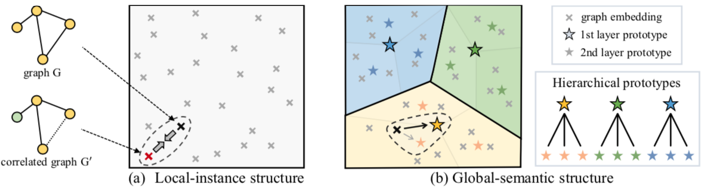

# Self-supervised Graph-level Representation Learning with Local and Global Structure

<p align="center">
   
</p>

## Introduction

This project is an implementation of ``Self-supervised Graph-level Representation Learning with Local and Global Structure'' in PyTorch, which is accepted as Short Talk by *ICML 2021*. 
We provide the pre-training and fine-tuning codes and also the pre-trained model on chemistry domain in this repository, and a more complete code version including the biology domain will be announced on the [TorchDrug](https://deepgraphlearning.github.io/torchdrug-site-dev/docs/index.html) platform developed by [MilaGraph](https://github.com/DeepGraphLearning) group. 
Also, we would like to appreciate the excellent work of [Pretrain-GNNs](https://github.com/snap-stanford/pretrain-gnns) which lays a solid foundation for our work.

More details of this work can be found in our paper: [[Paper (arXiv)]]().

## Prerequisites

We develop this project with `Python3.6` and following Python packages:

```
Pytorch                   1.1.0
torch-cluster             1.4.5                    
torch-geometric           1.0.3                    
torch-scatter             1.4.0                    
torch-sparse              0.4.4                    
torch-spline-conv         1.0.6 
rdkit                     2019.03.1
```

**P.S.** In our project, these packages can be successfully installed and work together under `CUDA/9.0` and `cuDNN/7.0.5`.

## Dataset Preparation

In the root direction of this project, create a folder for storing datasets:

```
mkdir dataset
```

The pre-training and fine-tuning datasets on chemistry domain can be downloaded from [the project page of Pretrain-GNNs](http://snap.stanford.edu/gnn-pretrain).

## Pre-training

To pre-train with the proposed **GraphLoG** method, simply run:
```
python pretrain_graphlog.py --output_model_file $pre-trained_model$
```

## Fine-tuning

To fine-tune on a downstream dataset, simply run (five independent runs will perform):
```
python finetune.py --input_model_file $pre-trained_model$ \
                   --dataset $downstream_dataset$
```

## Pretrained Model

We provide the GIN model pre-trained by GraphLoG at `./models/`.

## Citation

If this work helps your research, you can kindly cite the following paper (will be updated when the ICML paper is published).

```
@article{xu2021self-supervised,
  title={Self-supervised Graph-level Representation Learning with Local and Global Structure},
  author={Xu, Minghao and Wang, Hang and Ni, Bingbing and Guo, Hongyu and Tang, Jian},
  journal={arXiv preprint arXiv:},
  year={2021}
}
```